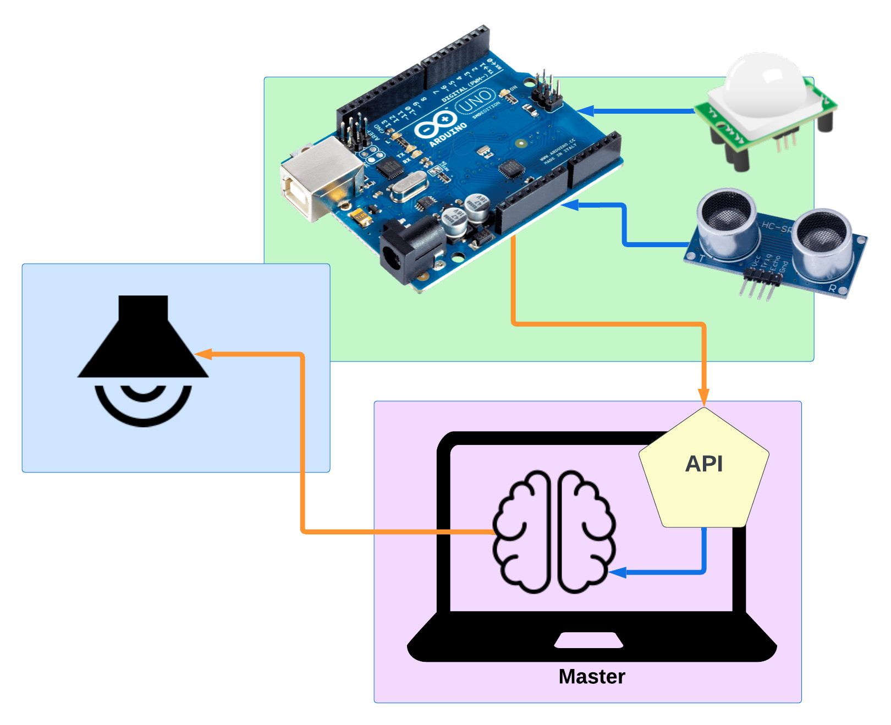

Art exhibit where sensors monitor an area, and plays different sounds depending on where the viewer is standing.

<p align="center">
    
</p>


## Hardware 🔨

### Electrical

- Arduino Uno or equivalent board
- Ultrasonic sensor → PIN 3 (SCL) and PIN 4 (SDA)
- PIR motion sensor → PIN 2

## Software 🍦
- Make
- Arduino C 
- Python 
    - Flask
    - Flask CORS
    - Flask API
	- Python Dotenv
	- Requests
	- Numpy
- Golang
	- dotenv
	- fyne
- ffmpeg
- OpenCV

### Setup

1. Clone repo and navigate inside 

2. Create a __.env__ file and set HOST_IP environment variable

```python
HOST_IP=192.168.0.11
```
You can find your local network address with terminal command 

```bash
 ifconfig | grep -E "100\.[0-9]{2,3}+\.[0-9]{2,3}+\.[0-9]{2,3}+" | awk '{print $2}'
```

3. Install dependencies with 

```python
# python
pip3 install flask flask-restful flask-cors python-dotenv numpy opencv
# golang
go get github.com/joho/godotenv && go get fyne.io/fyne/v2
```

### Run

```bash
// Start webserver
make master
```
